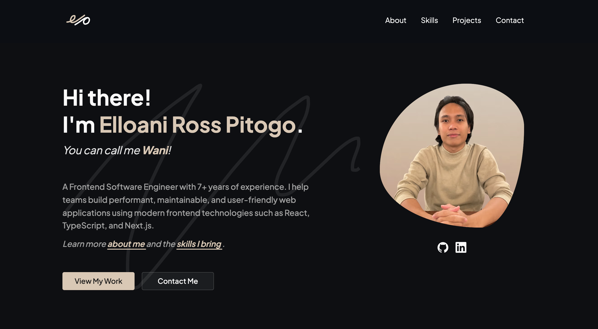

# Portfolio v4

A modern portfolio website built with Astro, React, TypeScript, Tailwind CSS, and Sanity CMS, showcasing Elloani Ross Pitogo's professional work profile, experience, skills, and projects through polished, performant, and responsive UI.



View the live project [here](https://www.elloanipitogo.com/).

## Overview

This repository contains the fourth version of my personal portfolio website. It is designed as a professional frontend showcase: performant, content-managed, responsive, accessible, and easy to maintain as different sections and content change over time.

The site is structured around the sections recruiters and hiring teams usually scan first:

- hero introduction with calls to action and social links
- about section with CMS-managed content
- skills section grouped by category
- project showcase with screenshots, description, technology tags, live links, and source-code links
- contact section with a validated form and direct email fallback

## Tech Stack

| Area       | Tools                                                   |
| ---------- | ------------------------------------------------------- |
| Framework  | Astro, React                                            |
| Language   | TypeScript                                              |
| Styling    | Tailwind CSS                                            |
| CMS        | Sanity                                                  |
| Forms      | React Hook Form, Zod, Formspree                         |
| UI         | Radix UI primitives, lucide-react, Sonner               |
| Motion     | Motion for React                                        |
| Deployment | Vercel adapter, Vercel Analytics, Vercel Speed Insights |
| Tooling    | ESLint, Prettier, Husky, lint-staged, Commitizen        |

## Features

- Content-managed portfolio sections powered by Sanity Studio.
- Astro page structure with React islands for interactive UI.
- Responsive project display: carousel on smaller screens and grid layout on larger screens.
- Optimized Sanity project images with responsive `srcset`, cropped aspect ratios, lazy loading, and lightweight blurred placeholders.
- Accessible contact form with schema validation, loading state, success/error toasts, and honeypot spam protection.
- CMS-managed SEO title, SEO description, navigation links, and footer content.
- Centralized design tokens for color, typography, spacing, radius, and responsive layout wrappers.
- Production-oriented Vercel setup with analytics and speed insights.

## Architecture

```txt
src/
  pages/
    index.astro                Main page composition
  layouts/
    BaseLayout.astro           Shared document shell, SEO, navigation, footer
  components/
    HeroSection/               Intro, portrait, CTA buttons, social links
    AboutSection/              CMS-managed about content
    SkillsSection/             Responsive skills accordion
    ProjectsSection/           Project carousel, grid, and cards
    ContactSection/            Contact content and validated form
    ui/                        Reusable UI primitives
  lib/
    sanity/queries.ts          GROQ queries and TypeScript result types
    utils.ts                   Shared utility helpers
  styles/
    global.css                 Tailwind setup and design tokens

sanity-studio/
  schemaTypes/                 CMS document schemas for portfolio content
  sanity.config.ts             Sanity Studio configuration
```

## Engineering Notes

The portfolio uses Astro for the main site shell and server-rendered page composition, then adds React only where interactivity is needed. This keeps the frontend focused and avoids shipping unnecessary client-side JavaScript for static content.

Interactive sections are hydrated lazily with Astro directives. The skills accordion, project carousel/grid, and contact form use `client:visible` so their React code loads when the section approaches the viewport, while the toast system uses `client:idle` to stay out of the initial render path.

Sanity owns the content model for the portfolio sections as well as navigation, SEO, and footer settings. The frontend queries typed Sanity data and includes fallbacks for core layout content.

Image loading is split by priority. Hero and logo assets load eagerly because they are part of the first impression, while project screenshots, about illustrations, and skill icons use lazy loading and async decoding. Hero section and project card images request appropriately sized Sanity images, generate responsive `srcset` values, preserve stable aspect ratios, and use lightweight blurred placeholders where helpful.

The homepage sets explicit cache headers for Vercel, balancing fresh content with CDN caching through `stale-while-revalidate`. Vercel Analytics and Speed Insights are included in the base layout to monitor real-world usage and performance after deployment.

The contact form uses React Hook Form and Zod for validation, then submits to Formspree with success and error feedback through Sonner toasts.

## Getting Started

Install dependencies:

```bash
pnpm install
```

Create a local environment file for the Astro app:

```bash
cp .env.example .env.local
```

Add your Sanity project values:

```bash
PUBLIC_SANITY_PROJECT_ID=
PUBLIC_SANITY_DATASET=
```

Start the frontend locally:

```bash
pnpm run dev
```

Build the frontend:

```bash
pnpm run build
```

Preview the production build locally:

```bash
pnpm run preview
```

## Quality Checks

Run linting:

```bash
pnpm run lint
```

Check formatting:

```bash
pnpm run format:check
```

Fix lint and formatting issues:

```bash
pnpm run lint:fix
pnpm run format:fix
```

## Sanity Studio

Install dependencies for the Studio:

```bash
pnpm --dir ./sanity-studio install
```

Create a local environment file for the Studio:

```bash
cp sanity-studio/.env.example sanity-studio/.env.local
```

Add the Studio environment values:

```bash
SANITY_STUDIO_PROJECT_ID=
SANITY_STUDIO_DATASET=
```

Run the Studio locally:

```bash
pnpm studio:dev
```

Build the Studio:

```bash
pnpm studio:build
```

### Vercel Studio Deployment

If the Vercel project uses `sanity-studio` as its root directory:

```bash
Build Command: pnpm build
Output Directory: dist
```

If the Vercel project uses the repository root:

```bash
Build Command: pnpm studio:build
Output Directory: sanity-studio/dist
```

Add these environment variables in the Vercel project:

```bash
SANITY_STUDIO_PROJECT_ID=
SANITY_STUDIO_DATASET=
```

## Deployment

The website and Sanity Studio are deployed separately.

Publishing content in Sanity updates portfolio content. Deploying the Sanity Studio updates the CMS interface and schema. Deploying the frontend updates the website code, components, styles, and application behavior.

The frontend is configured for Vercel through `@astrojs/vercel` and includes Vercel Analytics and Speed Insights in the base layout.
